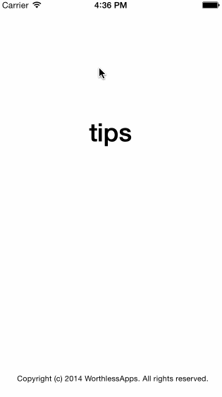

# Tip Calculator Prework for CODEPATH

Sample Swift project used to apply to [CodePath iOS bootcamp](https://courses.codepath.com/snippets/intro_to_ios/thanks_for_applying).

Time spent: Approximately 4 hours total

Required stories: 
* [x] Follow Swift video walkthrough to create Tip Calculator application
* [x] Create a settings view
* [x] Modify UI to improve look

Optional stories:
* Added a label for the split bill total, using a slider as an input for the number of people to split the bill by, from 1 - 10.

GIF Created with [LiceCap](http://www.cockos.com/licecap/).
